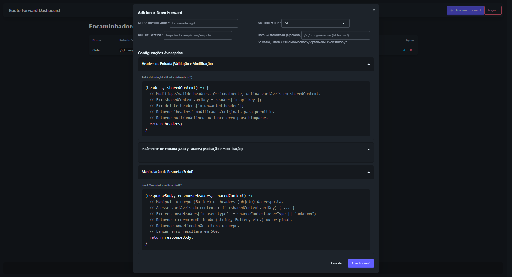

# Route Forward - Gerenciador de Encaminhamento de API

[](LICENSE)
<!-- Adicione outros badges aqui, como status de build, cobertura, etc., se aplicável -->

**Route Forward** é um sistema flexível para encaminhamento de requisições de API, construído com Node.js (Express) para o backend e React (Vite) para o dashboard frontend. Ele permite definir endpoints customizados que recebem requisições, processam-nas de acordo com regras configuráveis (incluindo validação/modificação de headers/parâmetros via JavaScript), encaminham-nas para uma API de destino e manipulam a resposta antes de retorná-la ao cliente original.

## Visão Geral do Dashboard



## Principais Funcionalidades

*   **Dashboard UI:** Gerencie as configurações de encaminhamento facilmente através de uma interface web (React + TailwindCSS + daisyUI).
*   **Roteamento Flexível:**
    *   Exponha rotas de API customizadas (ex: `/meu-servico/chat`).
    *   Roteamento automático baseado em slug (`/<slug-do-nome-do-forward>/...`) usando o caminho da API de destino se nenhuma rota customizada for especificada.
*   **Validação e Modificação de Requisições:**
    *   Use snippets JavaScript customizados (executados de forma segura em um sandbox) para validar ou modificar headers e parâmetros (query ou body) das requisições de entrada.
    *   Bloqueie requisições com base na lógica de validação.
*   **Manipulação de Respostas:**
    *   Intercepte a resposta da API de destino.
    *   Use snippets JavaScript customizados para modificar o corpo ou headers da resposta antes de enviá-la de volta ao cliente.
*   **Contexto Compartilhado:** Passe dados entre os diferentes estágios de execução dos scripts (validação de headers -> validação de parâmetros -> manipulação de resposta) para fluxos de trabalho complexos.
*   **Autenticação:** Login simples baseado em credenciais para acesso ao dashboard usando JWT.
*   **Persistência:** As configurações são armazenadas em um banco de dados SQLite local.

## Estrutura do Projeto

```
.
├── .env                # Variáveis de ambiente (crie este arquivo)
├── .env.example        # Exemplo de variáveis de ambiente
├── .gitignore          # Arquivos e pastas ignorados pelo Git
├── backend/            # API Node.js/Express e lógica de encaminhamento
│   ├── db/             # Local do arquivo do banco de dados SQLite
│   ├── middleware/     # Middleware de autenticação
│   ├── node_modules/
│   ├── routes/         # Rotas da API para operações CRUD
│   ├── services/       # Lógica de negócio para os forwards
│   ├── package.json
│   └── server.js       # Arquivo principal do servidor backend
├── frontend/           # Dashboard UI React/Vite
│   ├── node_modules/
│   ├── public/
│   ├── src/
│   │   ├── components/ # Componentes React
│   │   ├── context/    # Contexto de Autenticação
│   │   └── services/   # Cliente da API
│   ├── index.html
│   ├── package.json
│   └── vite.config.js
├── image.png           # Screenshot do dashboard (adicione sua imagem aqui)
├── LICENSE             # Arquivo de licença (MIT)
└── README.md           # Este arquivo (em pt-BR)
```

## Requisitos

*   Node.js (v18.x ou superior recomendado)
*   npm (v8.x ou superior recomendado, geralmente incluído com o Node.js)

## Instalação

1.  **Clone o Repositório:**
    ```bash
    git clone git@github.com:HellFiveOsborn/api_router_forward.git
    cd api_router_forward
    ```

2.  **Instale as Dependências do Backend:**
    ```bash
    cd backend
    npm install
    cd ..
    ```

3.  **Instale as Dependências do Frontend:**
    ```bash
    cd frontend
    npm install
    cd ..
    ```

4.  **Configure as Variáveis de Ambiente:**
    *   Crie um arquivo `.env` na raiz do projeto (copie do `.env.example` se preferir).
    *   Ajuste os valores conforme necessário. Veja o arquivo `.env.example` para as variáveis disponíveis.
    *   **Segurança:** Certifique-se de que `JWT_SECRET` seja forte e mantido em segredo, especialmente em produção. Não adicione o arquivo `.env` ao controle de versão (`.gitignore` já está configurado para isso).

## Executando a Aplicação

Você precisará de dois terminais/abas abertos na raiz do projeto (`api_router_forward`).

1.  **Terminal 1: Inicie o Servidor Backend:**
    ```bash
    cd backend
    npm run dev
    ```
    O servidor backend iniciará (normalmente em `http://localhost:3001`). Observe o console para logs e possíveis erros. Ele usa `nodemon` para reiniciar automaticamente ao salvar alterações.

2.  **Terminal 2: Inicie o Servidor de Desenvolvimento Frontend:**
    ```bash
    cd frontend
    npm run dev
    ```
    O servidor de desenvolvimento frontend iniciará (normalmente em `http://localhost:5173` ou outra porta indicada pelo Vite). Abra esta URL no seu navegador.

## Como Usar

1.  **Login:** Acesse a URL do frontend no navegador e faça login com as credenciais `USER` e `PASSWORD` definidas no seu arquivo `.env`.
2.  **Dashboard:** O dashboard principal exibe a lista de encaminhamentos configurados.
3.  **Adicionar/Editar Encaminhamentos:**
    *   Clique em "Adicionar Forward" ou no ícone de edição em um encaminhamento existente.
    *   **Nome Identificador:** Um nome único para este encaminhamento (ex: "Proxy OpenAI Chat"). Um `slug` amigável para URL será gerado automaticamente a partir deste nome (ex: "proxy-openai-chat").
    *   **Método HTTP:** O método HTTP ao qual o encaminhamento deve responder (GET, POST, etc.).
    *   **URL de Destino:** O endpoint real da API para o qual a requisição será encaminhada (ex: `https://api.openai.com/v1/chat/completions`).
    *   **Rota Customizada (Opcional):** O caminho específico *após* o slug que este encaminhamento tratará.
        *   Se fornecido (ex: `/v1/chat/completions`), a rota completa exposta pelo sistema será `/<slug>/v1/chat/completions`.
        *   Se deixado em branco, o sistema usará automaticamente o caminho da "URL de Destino" (ex: se a URL for `https://api.example.com/some/path`, a rota será `/<slug>/some/path`).
    *   **Configurações Avançadas (Scripts):**
        *   **Headers de Entrada:** Use JavaScript (`(headers, sharedContext) => { ... }`) para validar ou modificar os headers da requisição de entrada. Você também pode definir variáveis em `sharedContext` para passar dados para scripts posteriores. Retorne o objeto `headers` (modificado ou original) para prosseguir, ou retorne `null`/`undefined` ou lance um erro para bloquear.
        *   **Parâmetros de Entrada:** Use JavaScript (`(params, sharedContext) => { ... }`) para validar ou modificar os parâmetros de query (GET) ou o corpo da requisição (POST/PUT/PATCH). `params` será o objeto relevante. Retorne o objeto `params` (modificado ou original) para prosseguir, ou retorne `null`/`undefined` ou lance um erro para bloquear.
        *   **Manipulação da Resposta:** Use JavaScript (`(responseBody, responseHeaders, sharedContext) => { ... }`) para modificar o corpo da resposta (recebido como um Buffer) ou os headers recebidos da API de destino antes de enviá-la de volta ao cliente. Acesse dados definidos em scripts anteriores via `sharedContext`. Retorne o corpo modificado (ex: string, Buffer, `JSON.stringify(newObj)`) ou o `responseBody` original. Retornar `undefined` não altera o corpo. Lançar um erro resulta em uma resposta 500 para o cliente.
4.  **Testando:** Envie requisições para as rotas configuradas no sistema (ex: `http://localhost:3001/<slug>/<rota>`) usando ferramentas como `curl`, Postman ou Insomnia para verificar o encaminhamento e a lógica dos scripts.

## Licença

Este projeto está licenciado sob a Licença MIT. Veja o arquivo `LICENSE` para mais detalhes.
