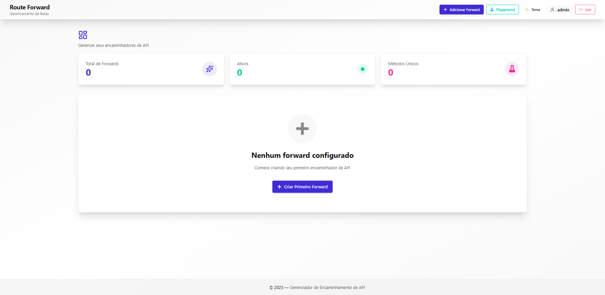
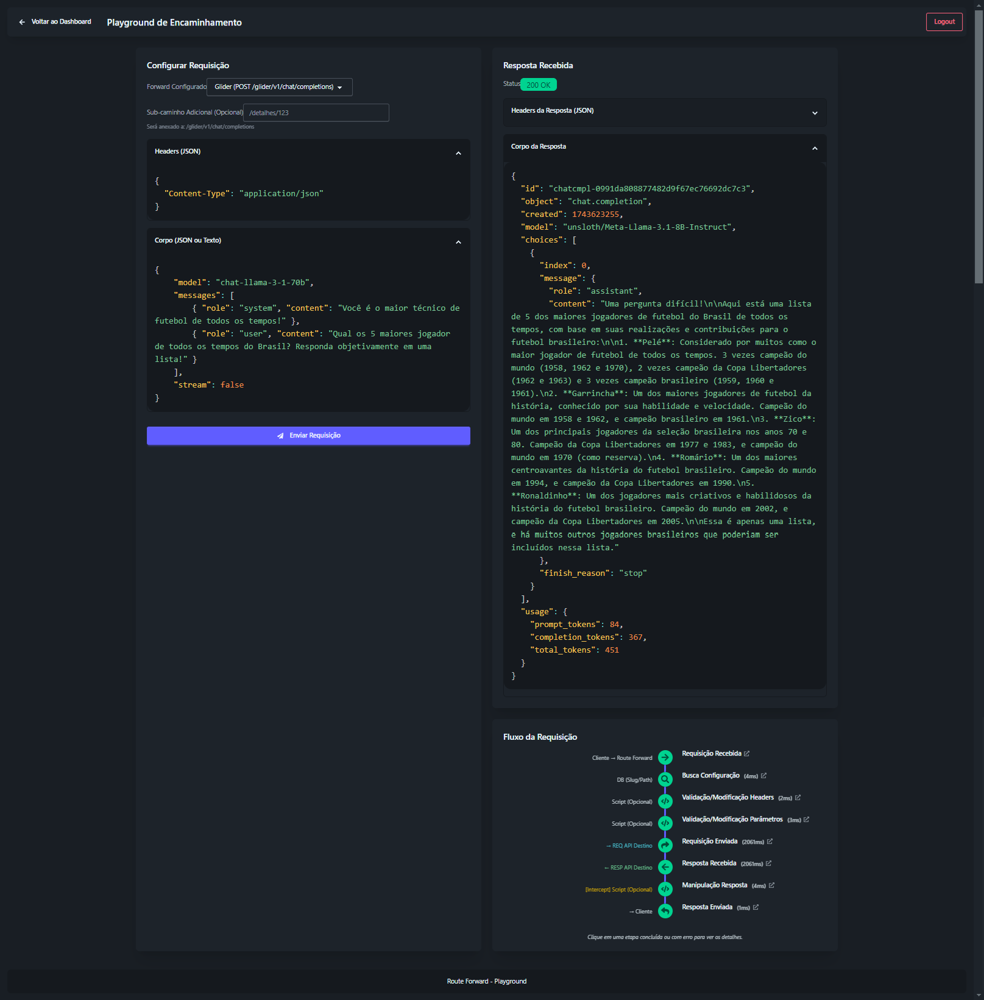
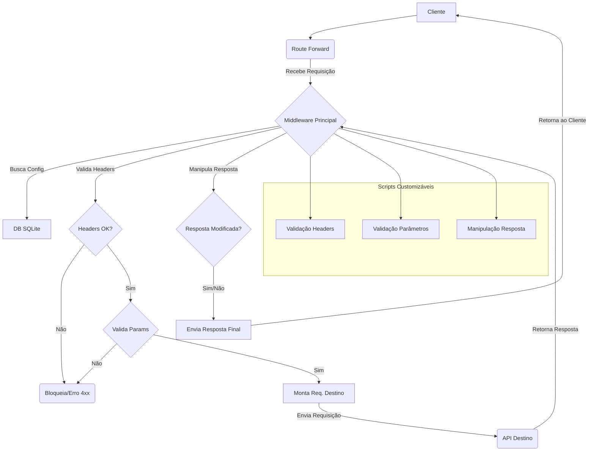

# Route Forward - Gerenciador de Encaminhamento de API

[](LICENSE)

<!-- Adicione outros badges aqui, como status de build, cobertura, etc., se aplicável -->

**Route Forward** é um sistema flexível para encaminhamento de requisições de API, construído com Node.js (Express) para o backend e React (Vite) para o dashboard frontend. Ele permite definir endpoints customizados que recebem requisições, processam-nas de acordo com regras configuráveis (incluindo validação/modificação de headers/parâmetros via JavaScript), encaminham-nas para uma API de destino e manipulam a resposta antes de retorná-la ao cliente original.

## Visão Geral do Dashboard



<details>
<summary>🖼️ Clique para ver o Playground</summary>



</details>

## Principais Funcionalidades

- **Dashboard UI:** Gerencie as configurações de encaminhamento facilmente através de uma interface web (React + TailwindCSS + daisyUI).
- **Roteamento Flexível:**
  - Exponha rotas de API customizadas (ex: `/meu-servico/chat`).
  - Roteamento automático baseado em slug (`/<slug-do-nome-do-forward>/...`) usando o caminho da API de destino se nenhuma rota customizada for especificada.
- **Validação e Modificação de Requisições:**
  - Use snippets JavaScript customizados (executados de forma segura em um sandbox) para validar ou modificar headers e parâmetros (query ou body) das requisições de entrada.
  - Bloqueie requisições com base na lógica de validação.
- **Manipulação de Respostas:**
  - Intercepte a resposta da API de destino.
  - Use snippets JavaScript customizados para modificar o corpo ou headers da resposta antes de enviá-la de volta ao cliente.
- **Contexto Compartilhado:** Passe dados entre os diferentes estágios de execução dos scripts (validação de headers -> validação de parâmetros -> manipulação de resposta) para fluxos de trabalho complexos.
- **Autenticação:** Login simples baseado em credenciais para acesso ao dashboard usando JWT.
- **Persistência:** As configurações são armazenadas em um banco de dados SQLite local.

## Fluxo da Requisição (Simplificado)



## Estrutura do Projeto

```
.
├── .env                # Variáveis de ambiente (crie este arquivo)
├── .env.example        # Exemplo de variáveis de ambiente
├── .gitignore          # Arquivos e pastas ignorados pelo Git
├── backend/            # API Node.js/Express e lógica de encaminhamento
│   ├── db/             # Local do arquivo do banco de dados SQLite
│   ├── middleware/     # Middleware de autenticação
│   ├── node_modules/
│   ├── routes/         # Rotas da API para operações CRUD
│   ├── services/       # Lógica de negócio para os forwards
│   ├── package.json
│   └── server.js       # Arquivo principal do servidor backend
├── frontend/           # Dashboard UI React/Vite
│   ├── node_modules/
│   ├── public/
│   ├── src/
│   │   ├── components/ # Componentes React
│   │   ├── context/    # Contexto de Autenticação
│   │   └── services/   # Cliente da API
│   ├── index.html
│   ├── package.json
│   └── vite.config.js
├── images/             # Imagens do README
├── LICENSE             # Arquivo de licença (MIT)
└── README.md           # Este arquivo (em pt-BR)
```

## Requisitos

- Node.js (v18.x ou superior recomendado)
- npm (v8.x ou superior recomendado, geralmente incluído com o Node.js)

## Instalação

1.  **Clone o Repositório:**

    ```bash
    git clone git@github.com:HellFiveOsborn/api_router_forward.git
    cd api_router_forward
    ```

2.  **Instale as Dependências do Backend:**

    ```bash
    cd backend
    npm install
    cd ..
    ```

3.  **Instale as Dependências do Frontend:**

    ```bash
    cd frontend
    npm install
    cd ..
    ```

4.  **Configure as Variáveis de Ambiente:**
    - Crie um arquivo `.env` na raiz do projeto (copie do `.env.example` se preferir).
    - Ajuste os valores conforme necessário. Veja o arquivo `.env.example` para as variáveis disponíveis.
    - **Segurança:** Certifique-se de que `JWT_SECRET` seja forte e mantido em segredo, especialmente em produção. Não adicione o arquivo `.env` ao controle de versão (`.gitignore` já está configurado para isso).

## Executando a Aplicação

Você precisará de dois terminais/abas abertos na raiz do projeto (`api_router_forward`).

1.  **Terminal 1: Inicie o Servidor Backend:**

    ```bash
    cd backend
    npm run dev
    ```

    O servidor backend iniciará (normalmente em `http://localhost:3001`). Observe o console para logs e possíveis erros. Ele usa `nodemon` para reiniciar automaticamente ao salvar alterações.

2.  **Terminal 2: Inicie o Servidor de Desenvolvimento Frontend:**
    ```bash
    cd frontend
    npm run dev
    ```
    O servidor de desenvolvimento frontend iniciará (normalmente em `http://localhost:5173` ou outra porta indicada pelo Vite). Abra esta URL no seu navegador.

## Como Usar

1.  **Login:** Acesse a URL do frontend no navegador e faça login com as credenciais `USER` e `PASSWORD` definidas no seu arquivo `.env`.
2.  **Dashboard:** O dashboard principal exibe a lista de encaminhamentos configurados.
3.  **Adicionar/Editar Encaminhamentos:**
    - Clique em "Adicionar Forward" ou no ícone de edição em um encaminhamento existente.
    - **Nome Identificador:** Um nome único para este encaminhamento (ex: "Proxy OpenAI Chat"). Um `slug` amigável para URL será gerado automaticamente a partir deste nome (ex: "proxy-openai-chat").
    - **Métodos HTTP:** Selecione um ou mais métodos (GET, POST, PUT, DELETE, PATCH).
    - **URL de Destino:** A URL base da API para onde as requisições serão encaminhadas (ex: `https://api.openai.com/`).
    - **Rota Customizada (Opcional):** O caminho específico após o slug que este encaminhamento tratará.
      - Se fornecido (ex: `/v1/chat/completions`), a rota completa exposta será `/<slug>/v1/chat/completions/*`.
      - Se deixado em branco, o sistema expõe `/<slug>/*` e encaminha o trecho wildcard para a URL de destino.
    - **Configurações Avançadas (Scripts):**
      - Os editores aceitam apenas o corpo do script. O sandbox expõe o objeto `data` (API unificada).
      - Headers: `const h = data.getHeaders(); data.setHeader('X-A','1'); data.removeHeader('authorization');`
      - Parâmetros: `const b = data.getBody(); if (!b?.page) { data.setBody({ ...b, page: 1 }); }`
      - Rota destino: `data.setDestRoute({ addPath: '/v2' });`
      - Resposta: `data.onResponse(() => { data.responseCode(200); data.setResponse({ body: Buffer.from('OK'), headers: { 'Content-Type': 'text/plain' } }); });`
      - Bloquear: `data.Exception('API Key inválida', 401);` interrompe imediatamente o pipeline.
      - Dica: clique em "Docs" no modal para abrir a documentação interativa com índice, âncoras e botões "Copiar".
4.  **Testando:** Envie requisições para as rotas configuradas (ex: `http://localhost:3001/<slug>/<rota>`), usando `curl`, Postman ou Insomnia.

## Editor de Scripts e Documentação Integrada

- O botão "Docs" no modal de criação/edição abre um painel com:
  - Sumário lateral com navegação por seções (Método HTTP, Headers, Rota, Body/Parâmetros, Storage, Exceção, Resposta, Fetch, Exemplos).
  - Blocos por categoria com título, descrição curta e exemplos práticos.
  - Botões "Copiar" nos exemplos para agilizar o uso.
  - Layout responsivo e leitura aprimorada.
    Código-fonte do modal: frontend/src/components/AddForwardModal.jsx

## Padrões de Rota e Extração de Parâmetros

- Suporte ao path-to-regexp v8 com chaves:
  - `/{provider}` captura um segmento. Exemplo: requisição `/<slug>/openai/v1/models` resulta em:
    - `params.provider === "openai"`
    - `params.wildcard === "v1/models"`
- Comportamento esperado:
  - O trecho wildcard é anexado à URL base de destino sem barras duplicadas.
  - Ajuste a URL final com `data.setDestRoute({ ... })`.
  - `data.Exception(msg, code)` interrompe imediatamente a execução e retorna o `code`.
- Exemplo:

  ```js
  // Rota configurada: "/{provider}"
  // Requisição: /scrimba/openai/v1/models
  const { params } = data.getRoute();
  // params.provider === "openai"
  // params.wildcard === "v1/models"

  // Opcionalmente, ajuste a URL destino:
  data.setDestRoute({ addPath: "/v2" }); // acrescenta /v2 antes do wildcard
  ```

## Licença

Este projeto está licenciado sob a Licença MIT. Veja o arquivo `LICENSE` para mais detalhes.
